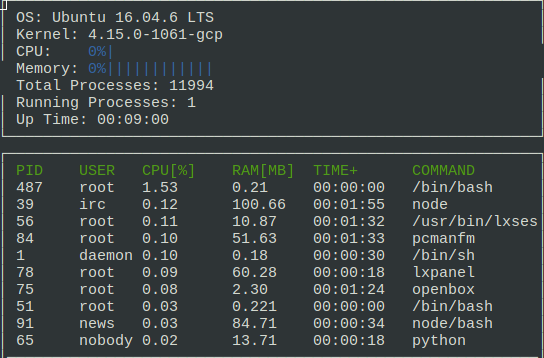
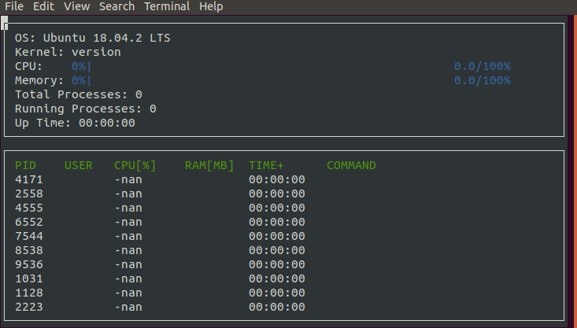

# System-Monitor-Manager

Starter code for System Monitor Project in the Object Oriented Programming.

## Linux Workspace 

You are welcome to develop this project on your local machine. However, You can develop convenient and consistent Linux development environment by following instruction below.

## ncurses
[ncurses](https://www.gnu.org/software/ncurses/) is a library that facilitates text-based graphical output in the terminal. This project relies on ncurses for display output.

Install ncurses within your own Linux environment: `sudo apt install libncurses5-dev libncursesw5-dev`

## Make
This project uses [Make](https://www.gnu.org/software/make/). The Makefile has four targets:
* `build` compiles the source code and generates an executable
* `format` applies [ClangFormat](https://clang.llvm.org/docs/ClangFormat.html) to style the source code
* `debug` compiles the source code and generates an executable, including debugging symbols
* `clean` deletes the `build/` directory, including all of the build artifacts

## Instructions

1. Clone the project repository: `git clone https://github.com/singhsduos/System-Monitor.git`

2. Build the project: `make build`

3. Run the resulting executable: `./build/monitor`

4. Follow along with these above steps.

5. Check the code `System`, `Process`, and `Processor` classes, as well as functions within the `LinuxParser` namespace.

6. If you want to change something than make change and give me a `pull request`.

7. `Thank You!` - By Neelesh Singh
